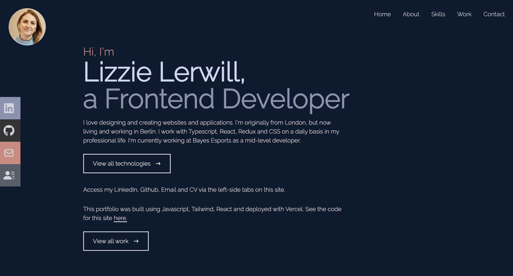
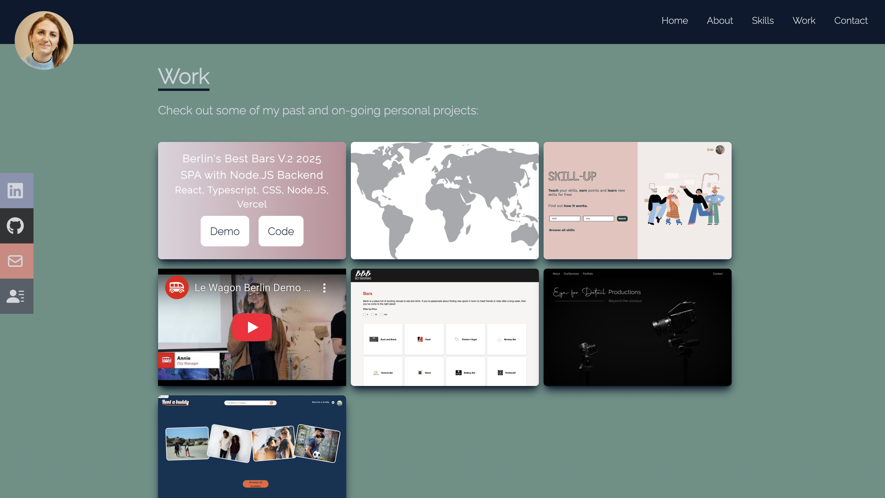
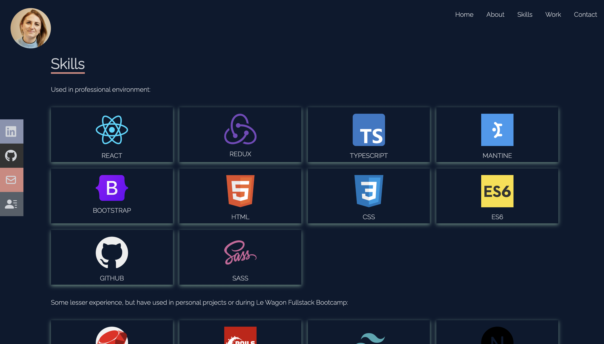

# My Portfolio Site

A portfolio website built using React JS and Tailwind CSS. I built this project to be able to share my work and a little bit more about myself.

# Website

www.lizzie-lerwill.com

## Available Scripts

In the project directory, you can run:

### `npm start`

Runs the app in the development mode.\
Open [http://localhost:3000](http://localhost:3000) to view it in your browser.

The page will reload when you make changes.\
You may also see any lint errors in the console.
